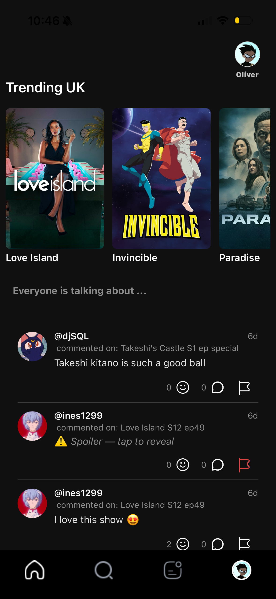
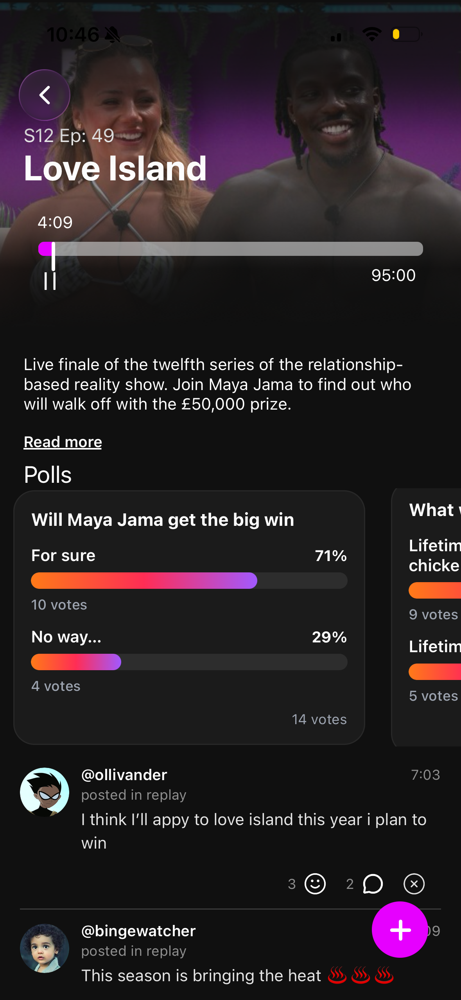
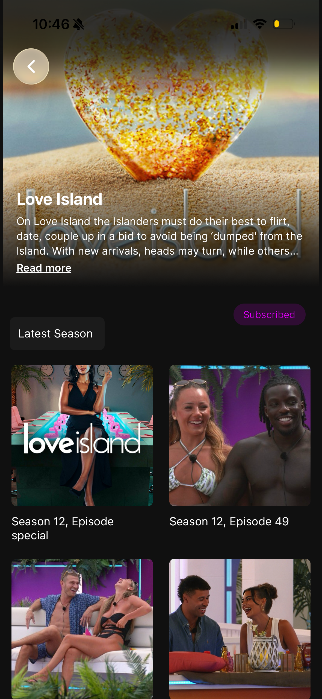

# SpillR - Real-Time TV Companion App

Real-time mobile app for episode-based live chat, reactions, and timeline-synchronised commentary.

---

## Demo

https://github.com/user-attachments/assets/cf04e9a8-d29e-442f-8524-978fb4c1583d

## Screenshots

  

  
  

---

## Overview

SpillR is a React Native social platform that adds a synchronised commentary layer to live and on-demand TV.

Users can:

- Join episode-specific live chat threads
- Post reactions and comments tied to exact timestamps
- Replay commentary in sync with episode playback

The platform works in two modes:

- **Live viewing** → users react in real time as episodes air
- **Replay mode** → users watch later and see comments appear exactly when they were originally posted

SpillR bridges the gap between watching alone and watching together.

---

## My Role

- Built key React Native UI components including **timeline scrubbing** and **interactive polls**
- Implemented backend endpoints supporting **offset-based pagination** for infinite scroll
- Developed logic to **prioritise comments from a user’s friends**
- Contributed to **WebSocket integration** for real-time comments and reactions
- Wrote utility functions for asynchronous data fetching
- Researched and integrated external APIs for TV show and episode data

---

## Architecture

The project is split across two repositories:

- Frontend: https://github.com/Ines1299/SpillR-app
- Backend: https://github.com/yewen-jin/spillr-BE

Architectural diagrams are available in `/screenshots`.

---

## Tech Stack

### Backend

- Node.js + Express REST API
- Socket.io for real-time communication
- PostgreSQL (Supabase)
- Hosted on Render
- GitHub Actions used to prevent server sleep (free tier workaround)

### Frontend

- React Native with Expo (iOS & Android)
- Polling system for fetching updates
- Timeline synchronisation using `setInterval()`

---

## Notable Features

- Real-time comments anchored to episode timestamps
- Infinite scroll with offset-based pagination
- Friend-prioritised comment feed
- Live reactions and polling
- Cross-platform mobile app

---

## Future Improvements

- Cron job to sync TV API data and automatically open episode threads
- Redis-based rate limiting to prevent spam
